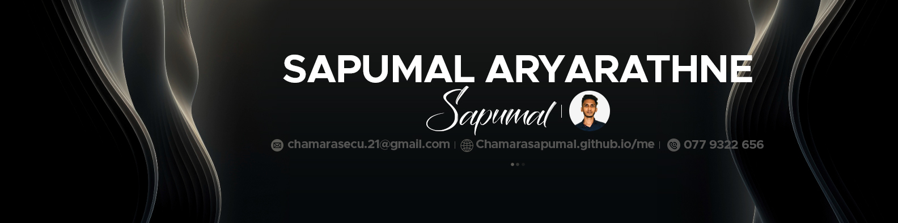

  
  

# 💫 About Me:

  

🔭 I'm currently working on:  
Improving my skills in web development, machine learning, and automation.

👯 I'm looking to collaborate on:  
Open-source projects related to web development, machine learning, and automation.

🤝 I'm looking for help with:  
Expanding my machine learning skills and exploring Python frameworks.

🌱 I'm currently learning:  
Machine Learning with Python and advanced concepts in Next.js.

💬 Ask me about:  
Full-stack web development, AutoCAD, SolidWorks, and my mechanical engineering journey.

⚡ Fun fact:  
I'm a mechanical engineering student with a passion for building innovative software applications.

## 🌐 Socials:

  
 
 
 

# 💻 Tech Stack:

### Languages
 
 
 
 
 
 
 

### Cloud & DevOps
 
 
 

### Frameworks & Libraries
 
 
 
 
 
 

### Databases & Tools
 
 
 

### Data Science & ML
 
 

### Design & Project Management
 

# 📊 GitHub Stats:

  

---

  

## 💰 You can help me by Donating
 

